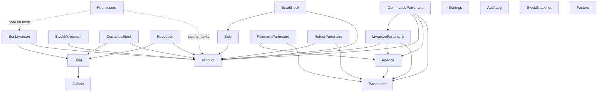

# AUDIT SaaS — Family Store POS

**Date :** 3 août 2026
**Périmètre :** `backend/` (8 742 lignes TS) · `frontend/` (28 898 lignes TS/TSX) · `desktop-caisse/` (Electron)
**Objet :** évaluer la faisabilité et le coût d'une transformation du logiciel en plateforme SaaS multi-clients.
**Note globale de préparation : 2,0 / 5** — le logiciel est fonctionnellement mûr mais structurellement mono-client.

---

## 1. Vue d'ensemble

### 1.1 Objectif du logiciel

Système de gestion complet pour supermarché / commerce de détail en Afrique centrale, couvrant la vente en caisse, la gestion des stocks sur deux niveaux (boutique + entrepôt), les achats fournisseurs, la distribution à des revendeurs grossistes, et le pilotage financier. Conçu pour fonctionner malgré une connexion internet instable — le mode hors-ligne est un choix d'architecture central, pas un ajout.

### 1.2 Modules fonctionnels (exhaustif)

| # | Module | Périmètre | Fichiers principaux |
|---|---|---|---|
| 1 | **Caisse / POS** | Panier, scan code-barres (`@zxing`), articles « divers » non référencés, remises ligne et facture, 6 modes de paiement (espèces, MTN MoMo, Orange Money, carte, mobile money, crédit), monnaie rendue, ticket PDF, vente forcée avec traçage d'écart | `sales/`, `pages/Caisse.tsx` (1 994 l.) |
| 2 | **Sessions de caisse** | Ouverture/fermeture par caissier, PIN à 4 chiffres, comptage des ventes et de l'encaissé | `sessions/`, `pages/CaissePin.tsx` |
| 3 | **Caisses physiques** | Déclaration des postes (code, PIN, ville), affectation d'un caissier à une caisse | `caisses/` |
| 4 | **Produits** | Catalogue, prix de vente et de revient, code-barres, unités, péremption, seuils d'alerte, verrouillage de prix par le magasinier, import/export CSV | `products/`, `pages/GestionProduits.tsx` |
| 5 | **Catégories** | Taxonomie éditable à deux niveaux (catégorie / sous-catégorie) | `categories/` |
| 6 | **Stock boutique** | Entrées/sorties tracées, inventaire, ajustements, étiquettes | `stock/`, `pages/Stocks*.tsx` |
| 7 | **Stock entrepôt (magasinier)** | Stock séparé du stock caisse, réceptions, transferts entrepôt→boutique via demandes | `magazinier/`, `pages/Magazinier.tsx` (1 568 l.) |
| 8 | **Demandes de stock** | Circuit gestionnaire → magasinier (demande / envoi / retour), avec statuts | `schemas/demande-stock.schema.ts` |
| 9 | **Écarts de stock** | Détection automatique lors des ventes forcées, résolution par le patron | `ecarts/` |
| 10 | **Fournisseurs** | Fiches, conditions de paiement, remises, notation, bons de livraison entrants, versements, retours fournisseur, calcul de dette | `fournisseurs/`, `bons-livraison/` |
| 11 | **Partenaires (grossistes)** | Le module le plus lourd : partenaires structurés avec agences, commandes, bons de livraison, dépôt-vente, créances, versements par agence ou communs, retours d'invendus, dette ancienne reportée | `partenaires/` (845 l. service, 75 opérations DB) |
| 12 | **Dépenses** | Saisie et catégorisation des charges | `expenses/` |
| 13 | **Factures** | Archivage des tickets en PDF base64, consultation et réimpression | `factures/` |
| 14 | **Rapports** | Analyses jour/semaine/mois, marges, top produits, comptabilité, exports Excel (`exceljs`) et PDF (`jspdf`) | `reports/` (1 406 l.) |
| 15 | **Snapshots de stock** | Photo quotidienne automatique de la valeur du stock, courbes d'évolution | `schemas/stock-snapshot.schema.ts` |
| 16 | **Utilisateurs & rôles** | 5 rôles, création réservée au patron, mot de passe oublié par email | `auth/` |
| 17 | **Journal d'audit** | Traçage horodaté de toutes les actions sensibles, TTL 365 jours | `audit/` |
| 18 | **Paramètres** | Identité du magasin, devise, logo, horaires, réseaux sociaux, langue, couleur, offre promotionnelle en pied de ticket | `settings/` |
| 19 | **Alertes** | Email automatique au patron sur seuil de stock bas (`nodemailer` / Gmail) | `mail/` |
| 20 | **Administration** | Réinitialisation de la base, purge des données transactionnelles | `admin/` |
| 21 | **Mode hors-ligne** | File d'attente IndexedDB pour ventes, produits et réceptions ; synchronisation automatique avec clés d'idempotence | `services/offlineSync.ts`, `services/offlineMagazin.ts` |

**136 routes API** réparties sur 19 contrôleurs.

### 1.3 Stack technique

| Couche | Technologie | Version |
|---|---|---|
| Backend | NestJS | ^10.0.0 |
| Runtime | Node.js | ≥ 18 |
| Langage | TypeScript | ^5.1.3 |
| Base de données | MongoDB (Atlas) | — |
| ODM | Mongoose + `@nestjs/mongoose` | ^7.5.0 / ^10.0.0 |
| Auth | `@nestjs/jwt` + `bcryptjs` | ^10.0.0 / ^3.0.3 |
| Frontend | React + React Router | ^18.2.0 / ^6.20.0 |
| Build | Vite | ^4.4.0 |
| Styles | Tailwind CSS | ^3.3.3 |
| Graphiques | Recharts | ^2.10.0 |
| PWA | `vite-plugin-pwa` (Workbox) | ^0.17.5 |
| Stockage local | `idb-keyval` | ^6.2.2 |
| Code-barres | `@zxing/browser` + `@zxing/library` | ^0.1.5 / ^0.21.3 |
| PDF | `jspdf` | ^4.2.1 (front) / ^2.5.2 (back) |
| Excel | `exceljs` | ^4.4.0 |
| Email | `nodemailer` (service Gmail) | ^6.9.7 |
| Captures | `puppeteer-core` | ^25.2.1 |
| Desktop | Electron | `desktop-caisse/` |

### 1.4 Architecture

**Frontend et backend séparés**, communiquant en REST sur `/api`. Le backend est un **monolithe modulaire NestJS** : 18 modules métier + 1 module global (`AuditModule`), chacun avec son contrôleur, son service et ses schémas Mongoose enregistrés via `MongooseModule.forFeature`.

```
familystore-pos/
├── backend/               NestJS — 93 fichiers .ts
│   ├── src/
│   │   ├── schemas/       23 schémas Mongoose partagés
│   │   ├── auth/          JWT, guards, rôles
│   │   ├── audit/         @Global — injectable partout
│   │   ├── {19 modules}/  products, sales, stock, partenaires…
│   │   ├── app.module.ts  connexion Mongo + import des modules
│   │   └── main.ts        bootstrap, CORS, préfixe /api
│   ├── seeds/seed.ts      jeu de données initial
│   ├── scripts/           19 scripts d'exploitation et de capture
│   └── render.yaml        déploiement Render
├── frontend/              React + Vite — 87 fichiers
│   └── src/
│       ├── api/           20 clients HTTP (fetch nu, pas d'axios)
│       ├── pages/         33 pages
│       ├── components/    13 composants
│       ├── services/      offlineSync, offlineMagazin
│       └── contexts/      SettingsContext (unique contexte global)
├── desktop-caisse/        Electron (main.js, preload.js, offline.html)
└── design-reference/
```

**Observation notable :** l'architecture est propre et cohérente. La séparation des modules est réelle, les schémas sont documentés en français, les décisions non évidentes sont commentées (idempotence, service worker, fuseau horaire). C'est un code maintenable — le problème du SaaS n'est pas la qualité, c'est une hypothèse de départ.

---

## 2. Base de données

### 2.1 Inventaire des modèles

**24 modèles** au total (23 dans `schemas/` + `Settings` dans son module).

| # | Modèle | Rôle | Références sortantes |
|---|---|---|---|
| 1 | `User` | Comptes utilisateurs | → `Caisse` (`caisseId`) |
| 2 | `Caisse` | Poste de caisse physique | — |
| 3 | `CaisseSession` | Session de travail d'un caissier | *aucune* (noms copiés en texte) |
| 4 | `Product` | Catalogue produits | *aucune* (`fournisseur` = chaîne libre) |
| 5 | `Category` | Taxonomie | — |
| 6 | `Sale` | Vente encaissée | → `Product` (par ligne) |
| 7 | `Facture` | Archive PDF du ticket | *aucune* (pas de lien vers `Sale`) |
| 8 | `Expense` | Dépense | — |
| 9 | `StockMovement` | Mouvement de stock | → `Product` |
| 10 | `StockSnapshot` | Valorisation quotidienne | — |
| 11 | `EcartStock` | Écart constaté en vente forcée | → `Product`, `Sale` |
| 12 | `DemandeStock` | Transfert entrepôt ↔ boutique | → `Product`, `User` |
| 13 | `Reception` | Entrée de marchandise | → `Product`, `User` |
| 14 | `Fournisseur` | Fiche fournisseur | — |
| 15 | `BonLivraison` | BL entrant fournisseur | → `Product`, `User` ; `fournisseur` = **chaîne** |
| 16 | `VersementFournisseur` | Règlement fournisseur | → `User` ; `fournisseur` = **chaîne** |
| 17 | `RetourFournisseur` | Retour de marchandise | → `Product`, `User` ; `fournisseur` = **chaîne** |
| 18 | `Partenaire` | Client grossiste | — |
| 19 | `Agence` | Point de vente d'un partenaire | → `Partenaire` |
| 20 | `CommandePartenaire` | Commande grossiste | → `Partenaire`, `Agence`, `Product`, `User`, `LivraisonPartenaire` |
| 21 | `LivraisonPartenaire` | BL sortant grossiste | → `Partenaire`, `Agence`, `CommandePartenaire`, `Product`, `User` |
| 22 | `PaiementPartenaire` | Règlement grossiste | → `Partenaire`, `Agence`, `User` |
| 23 | `RetourPartenaire` | Retour d'invendus | → `Partenaire`, `Product`, `User` |
| 24 | `AuditLog` | Journal | *aucune* (acteur en texte) |
| 25 | `Settings` | **Document unique** de configuration | — |

### 2.2 Graphe relationnel



### 2.3 Entités centrales

Quatre entités concentrent la gravité du système :

1. **`Product`** — référencée par 8 autres modèles. Porte deux stocks distincts (`stock` boutique et `stockMagazin` entrepôt), ce qui est inhabituel et rend chaque opération de stock potentiellement ambiguë.
2. **`Sale`** — le cœur de la valeur métier. Contient des *snapshots* (nom du produit, nom du caissier, nom de la caisse copiés en texte) plutôt que des références, choix délibéré pour préserver l'historique.
3. **`User`** — pivot des rôles et de la traçabilité.
4. **`Partenaire`** — racine d'un sous-système à lui seul (6 modèles, 75 opérations DB).

### 2.4 CRITIQUE — Existe-t-il une notion de « magasin » ou « entreprise » ?

**Non. Aucune.** C'est le constat central de cet audit.

Les 24 modèles ont été passés en revue : **aucun ne porte de champ `tenant`, `store`, `company`, `organisation`, `boutique` ou équivalent.** Tout le schéma repose sur l'hypothèse implicite d'un supermarché unique par base de données.

Trois éléments confirment cette conception mono-client de façon irréfutable :

**a) `Settings` est un document singleton.** [settings.service.ts:13](backend/src/settings/settings.service.ts#L13) fait `findOne()` sans aucun filtre, et `update()` fait `findOneAndUpdate({}, …, { upsert: true })` sur un filtre vide. Il ne peut exister qu'**une seule** configuration de magasin dans toute la base — un nom, un logo, une devise, une couleur.

**b) Les contraintes d'unicité sont globales.** `Caisse.code`, `Product.barcode`, `Sale.idempotencyKey`, `Reception.idempotencyKey`, `StockMovement.idempotencyKey`, `StockSnapshot.dateKey`, `User.email`, `LivraisonPartenaire.idempotencyKey` et l'index `Category{category, subCategory}` sont uniques à l'échelle de la collection entière. Deux supermarchés ne pourraient pas avoir chacun une « Caisse 01 » de code `C01`, ni vendre un produit portant le même code-barres.

**c) `StockSnapshot.dateKey` est unique globalement** — une seule photo de stock par jour pour toute la base. Avec deux clients, le second n'aurait jamais de snapshot.

Ce qui pourrait **ressembler** à du multi-site n'en est pas :
- `Caisse.ville` et `User.assignedLocation` sont des chaînes libres d'affichage, sans aucun filtrage applicatif ;
- `Agence` désigne les points de vente **d'un client grossiste**, pas des succursales du supermarché ;
- `Product.stockMagazin` sépare deux lieux de stockage du **même** commerce.

**Conclusion : la totalité de la base est à repenser pour le multi-tenant.** La bonne nouvelle est que le travail est mécanique et non conceptuel : aucune règle métier n'entre en conflit avec l'ajout d'une dimension tenant.

---

## 3. Authentification et rôles

### 3.1 Système d'authentification

**JWT sans état**, sans sessions serveur ni refresh token.

| Aspect | Implémentation | Emplacement |
|---|---|---|
| Émission | `JwtModule.register({ global: true })` | [auth.module.ts:19](backend/src/auth/auth.module.ts#L19) |
| Durée | `JWT_EXPIRES_IN` ou **30 jours** par défaut | [auth.module.ts:21](backend/src/auth/auth.module.ts#L21) |
| Secret | `JWT_SECRET` ou **`'fallback_secret'`** en dur | [auth.module.ts:20](backend/src/auth/auth.module.ts#L20) |
| Mots de passe | `bcrypt`, 10 tours | [auth.service.ts:62](backend/src/auth/auth.service.ts#L62) |
| Vérification | `AuthGuard` — décode et pose `request.user` | [auth.guard.ts](backend/src/auth/auth.guard.ts) |
| Stockage client | `localStorage.getItem('access_token')` | [api/http.ts](frontend/src/api/http.ts) |
| Expiration | Intercepteur global sur 401 → redirection login | [api/fetchInterceptor.ts](frontend/src/api/fetchInterceptor.ts) |
| Inactivité | Déconnexion après 10 min | [App.tsx:46](frontend/src/App.tsx#L46) |

**Contenu du jeton :** `sub`, `email`, `name`, `role`, et **l'objet caisse complet incluant le PIN en clair**. Ce dernier point est assumé dans le code : le PIN est embarqué pour permettre la vérification hors ligne ([caisse.schema.ts:14](backend/src/schemas/caisse.schema.ts#L14)).

**Récupération de mot de passe :** génère un mot de passe temporaire et l'envoie par email. Route publique, sans limitation de débit.

### 3.2 Rôles et permissions

5 rôles fixés dans un `enum` de schéma : `patron`, `gestionnaire`, `magazinier`, `caissier`, `commercial`.

| Rôle | Périmètre | Routes |
|---|---|---|
| `patron` | Accès total — seul à pouvoir créer des comptes, voir les rapports, modifier les paramètres, réinitialiser la base | 34 exclusives + toutes les partagées |
| `gestionnaire` | Stock boutique, produits, réceptions, inventaire | 26 partagées |
| `magazinier` | Stock entrepôt, réceptions, partenaires | 15 partagées |
| `caissier` | Caisse uniquement | 1 route explicite (le reste passe par `AuthGuard` seul) |
| `commercial` | **Rôle incomplet** — une seule route (`partenaires`), absent du seed | 1 |

Le contrôle est **déclaratif et plat** : décorateur `@Roles(...)` + `RolesGuard` qui vérifie l'appartenance à une liste. Pas de hiérarchie (le `patron` doit être listé explicitement partout), pas de permissions granulaires, pas de rôles personnalisables.

### 3.3 Gestion des utilisateurs

Création réservée au patron via `POST /api/auth/register`. Modification autorisée au patron ou à l'utilisateur lui-même. Le rattachement se fait par `caisseId` (caissiers) ou `assignedLocation` (chaîne libre, gestionnaires et magasiniers).

**Aucune notion de propriétaire de compte, d'invitation, ou d'appartenance à une organisation.** Le premier patron est créé par le script de seed, exécuté manuellement.

---

## 4. État de préparation SaaS

### 4.1 Multi-tenancy — **1 / 5**

Aucune isolation d'aucune sorte. Le code ne contient pas un seul filtre par client. Les 208 opérations Mongoose recensées interrogent leurs collections sans discriminant.

**Répartition des opérations à couvrir :**

| Service | Opérations DB | dont `aggregate` | dont `populate` |
|---|---|---|---|
| `partenaires` | 75 | 0 | 9 |
| `magazinier` | 25 | 0 | 12 |
| `fournisseurs` | 20 | 3 | 2 |
| `products` | 14 | 0 | 0 |
| `sessions` | 12 | 0 | 0 |
| `sales` | 12 | 2 | 3 |
| `stock` | 10 | 0 | 1 |
| `auth` | 9 | 1 | 1 |
| `factures` | 8 | 1 | 0 |
| `ecarts` | 8 | 3 | 0 |
| `reports` | 5 | 0 | 4 |
| autres | 10 | 0 | 1 |
| **Total** | **208** | **10** | **33** |

**Stratégie recommandée : colonne `tenantId` + plugin Mongoose global.**

| Stratégie | Verdict |
|---|---|
| **`tenantId` partagé + plugin Mongoose** | ✅ **Recommandée.** Un plugin appliqué à la connexion réécrit automatiquement tous les filtres. Les 208 appels existants n'ont pas à être modifiés un par un — c'est le seul point qui rend le chantier tenable. Coût marginal par client quasi nul. |
| Base par client | Viable et sans risque de fuite, mais coûte un cluster ou une base Atlas par client et complique les migrations de schéma. Pertinent pour un client « premium » exigeant, pas comme modèle par défaut. |
| Schémas séparés | Sans objet — concept SQL, MongoDB n'a pas d'équivalent réel. |
| Instance complète par client | C'est le modèle actuel (Family Store, Radiance). Ne monte pas en charge : chaque correctif doit être redéployé N fois. |

L'atout décisif ici est que **Mongoose supporte les plugins de schéma avec des hooks `pre` sur toutes les opérations**, y compris `aggregate` et `insertMany`. La discipline de code observée (aucun accès brut à la base, à une exception près traitée en §5.3) rend ce mécanisme fiable.

### 4.2 Configuration — **3 / 5**

Le modèle `Settings` est déjà riche et bien pensé : nom, adresse, ville, téléphone, email, devise, logo (base64), horaires, réseaux sociaux, langue (`fr`/`en`), couleur principale, et jusqu'au texte de l'offre promotionnelle imprimée en pied de ticket. **C'est une vraie base de personnalisation**, et la présence du champ `langue` montre que la question a déjà été anticipée.

**Ce qui manque ou bloque :**

| Problème | Détail |
|---|---|
| Singleton structurel | `findOne()` / `findOneAndUpdate({})` — un seul jeu de paramètres possible dans la base |
| Nom du produit en dur | « Family Store » codé dans **24 fichiers** (emails, tickets, sidebars, PDF, `<title>`, manifeste PWA) |
| Fuseau horaire en dur | `jourDouala()` — `Date.now() + 3600_000` figé sur UTC+1 ([fournisseurs.service.ts:35](backend/src/fournisseurs/fournisseurs.service.ts#L35)). Un client hors Afrique centrale aurait des snapshots et des dates de versement décalés |
| Aucune gestion de taxes | **Recherche `TVA` / `taxe` : zéro résultat.** Le logiciel ne calcule aucune taxe. Acceptable pour du commerce informel camerounais, bloquant pour tout client tenu à la TVA |
| Devise partiellement configurable | Le champ `devise` existe (défaut `XAF`) mais `FCFA`/`XAF` reste écrit en dur dans une vingtaine de fichiers d'affichage |
| Modules non désactivables | Pas de mécanisme pour masquer un module (le module Partenaires n'intéresse pas tous les commerces) |
| Fournisseurs de démonstration en dur | 4 fournisseurs camerounais fictifs codés dans le service ([fournisseurs.service.ts:26-31](backend/src/fournisseurs/fournisseurs.service.ts#L26)) |
| Catégories dupliquées | `frontend/src/data/categories.ts` coexiste avec le modèle `Category` |

### 4.3 Déploiement — **2 / 5**

**Configuration actuelle :** frontend statique sur Netlify, backend sur Render (région Frankfurt, **plan gratuit**), base sur MongoDB Atlas. Le routage `/api/*` passe par une redirection Netlify.

| Point | État | Impact SaaS |
|---|---|---|
| URL backend en dur | `familystore-pos.onrender.com` écrite dans [netlify.toml:9](frontend/netlify.toml#L9) | Chaque client exige un rebuild du frontend |
| Plan Render gratuit | Mise en veille après 15 min, **~30 s de démarrage à froid** | Inacceptable en SaaS payant : une caisse qui attend 30 s à l'ouverture |
| Une base par déploiement | `MONGO_URI` unique, aucune notion de routage | — |
| CORS ouvert | `app.enableCors()` sans restriction d'origine ([main.ts:16](backend/src/main.ts#L16)) | Toute origine peut appeler l'API |
| Pas de CI/CD | Aucun workflow GitHub, aucun test automatisé | Déploiement manuel, non reproductible |
| `dist/` versionné | `backend/dist/main.js` suivi par git | Conflits et build non reproductible |
| Pas de conteneurisation | Ni Dockerfile ni docker-compose | Provisionnement automatique impossible en l'état |
| Tâche planifiée dans le process | `setInterval` horaire dans un service ([fournisseurs.service.ts:53](backend/src/fournisseurs/fournisseurs.service.ts#L53)) | Avec plusieurs instances, le snapshot s'exécute en double |
| Bon point | `render.yaml` + `.env.example` + `DEPLOY.md` complets | Base saine pour automatiser |

**Verdict :** l'infrastructure actuelle convient à un client unique, pas à une plateforme. Le passage en SaaS impose au minimum un plan Render payant, une URL d'API injectée à la construction, et un vrai ordonnanceur (`@nestjs/schedule`).

### 4.4 Facturation — **1 / 5**

**Rien n'existe.** Aucun schéma d'abonnement, de plan, de paiement ou de client-payeur. Aucune intégration de prestataire de paiement. Aucune limitation d'usage.

Le seul acquis utile est indirect : la présence de `mtn_momo` et `orange_money` dans les modes de paiement des ventes montre que le contexte Mobile Money est déjà compris côté métier — mais il s'agit des encaissements **des clients du supermarché**, sans rapport avec l'encaissement d'un abonnement.

**Contrainte externe majeure :** Stripe et Paddle n'acceptent pas les comptes marchands au Cameroun. Les options réalistes sont CinetPay, Notch Pay ou Flutterwave — et **aucune ne permet de prélèvement récurrent fiable sur Mobile Money**. Le renouvellement d'abonnement devra être semi-manuel (notification → lien de paiement → webhook → prolongation), ce qui rend l'offre annuelle nettement préférable à l'offre mensuelle.

Tout est à construire : schémas `Tenant`/`Plan`/`Subscription`/`Payment`, garde d'abonnement, webhooks, relances, back-office.

### 4.5 Mode offline / PWA — **4 / 5 en tant que fonctionnalité, 2 / 5 pour la compatibilité multi-tenant**

**C'est la meilleure partie du projet.** L'implémentation est soignée et les décisions difficiles sont documentées dans le code :

- Service Worker en `registerType: 'prompt'` avec `skipWaiting: false` — une mise à jour ne recharge **jamais** la page en cours de vente, elle s'applique au lancement suivant. Le panier est protégé.
- `navigateFallbackDenylist` sur `/api/` et `.pdf` — corrige un bug réel où le manuel PDF renvoyait la page d'accueil.
- Files d'attente IndexedDB pour les ventes (`pending_sales`), les produits créés hors ligne (identifiants temporaires `temp-…`) et les réceptions.
- **Clés d'idempotence de bout en bout** : `Sale`, `Reception`, `StockMovement` et `LivraisonPartenaire` portent un index unique qui empêche tout doublon au rejeu. Le service de vente gère même la course entre deux requêtes concurrentes (code `11000`).
- Résolution des identifiants temporaires à la synchronisation : produits d'abord, puis réceptions avec substitution des `temp-…`.

**Le problème en multi-tenant est net et immédiat :**

Les clés IndexedDB sont **globales et non préfixées** — `'products'`, `'pending_sales'`, `'last_sync_time'`, `'magazin_pending_produits'`, `'stock_pending_ajouts'`… ([offlineSync.ts:9-11](frontend/src/services/offlineSync.ts#L9), [offlineMagazin.ts:17-21](frontend/src/services/offlineMagazin.ts#L17)).

Sur un domaine SaaS partagé (`app.monpos.com`), deux comptes de supermarchés différents utilisés successivement sur le même navigateur partageraient le même stock IndexedDB. Conséquences concrètes :

1. Le catalogue du client A resterait visible pour le client B après déconnexion — **fuite de données commerciales** ;
2. Une vente du client A en attente serait envoyée avec le jeton du client B — **corruption de données croisée**, non détectable puisque l'idempotence ne porte que sur la clé, pas sur le tenant.

De plus, `localStorage.getItem('access_token')` est également non préfixé, et les index uniques d'idempotence devront devenir `{ tenant, idempotencyKey }` sous peine de collisions inter-clients.

**Correctifs requis :** préfixer toutes les clés IndexedDB et `localStorage` par l'identifiant du tenant, purger le stock local à la déconnexion, et refuser la synchronisation d'une file dont le tenant ne correspond pas à la session courante.

### 4.6 Synthèse

| Critère | Note | Commentaire |
|---|---|---|
| Multi-tenancy | **1 / 5** | Inexistante ; stratégie `tenantId` + plugin viable |
| Configuration | **3 / 5** | `Settings` solide, mais singleton et 24 fichiers en dur |
| Déploiement | **2 / 5** | Mono-instance, plan gratuit, URL figée, pas de CI |
| Facturation | **1 / 5** | Néant |
| Offline / PWA | **4 / 5** *(2 / 5 en multi-tenant)* | Excellent, mais stockage local non cloisonné |
| **Global** | **2,0 / 5** | Base saine, hypothèse mono-client à lever partout |

---

## 5. Dette technique et risques

### 5.1 Points de friction majeurs

| # | Friction | Gravité |
|---|---|---|
| 1 | **Aucun test automatisé** — 0 fichier `.spec.ts` ou `.test.ts` dans tout le projet. Refactoriser 208 opérations DB sans filet est le risque n°1 du chantier | 🔴 Critique |
| 2 | **Aucune transaction MongoDB** — `startSession` / `withTransaction` absents. Une vente crée le document puis décrémente le stock en deux temps : une coupure entre les deux laisse la base incohérente | 🔴 Critique |
| 3 | **`Settings` singleton** — verrou structurel du multi-tenant | 🔴 Critique |
| 4 | **9 index uniques globaux** à convertir en composites, avec suppression et reconstruction sur données de production | 🟠 Élevée |
| 5 | **Fournisseur référencé par chaîne de caractères** — `Product.fournisseur`, `BonLivraison.fournisseur`, `VersementFournisseur.fournisseur`, `RetourFournisseur.fournisseur` sont des chaînes libres alors qu'un modèle `Fournisseur` existe. Aucune intégrité référentielle ; renommer un fournisseur casse ses versements | 🟠 Élevée |
| 6 | **Fichiers hors gabarit** — `Caisse.tsx` 1 994 l., `Partenaires.tsx` 1 981 l., `Magazinier.tsx` 1 568 l., `Stocks.tsx` 1 551 l., `reports.service.ts` 1 406 l. Toute modification transversale y est coûteuse | 🟠 Élevée |
| 7 | **Factures PDF stockées en base64 dans MongoDB** — `Facture.pdfBase64`. Un ticket pèse 30–80 Ko ; à 200 ventes/jour et 50 clients, la base grossit de plusieurs Go par mois. Coût Atlas et lenteur des requêtes | 🟠 Élevée |
| 8 | **`seed.ts` redéfinit les schémas en double** — copie manuelle divergente des vrais schémas ; le seed devra devenir le provisionnement d'un nouveau client | 🟡 Moyenne |
| 9 | **Fuseau horaire figé sur UTC+1** | 🟡 Moyenne |
| 10 | **`setInterval` dans un service** pour le snapshot quotidien — double exécution dès qu'il y a plusieurs instances | 🟡 Moyenne |
| 11 | **`dist/` versionné dans git** | 🟡 Moyenne |
| 12 | **Rôle `commercial` incomplet** — dans l'`enum`, une seule route, absent du seed | 🟢 Faible |

### 5.2 Ordre de refactorisation prioritaire

1. **Écrire une suite de tests d'isolation avant toute chose.** Deux tenants, données croisées, vérification sur les 136 routes. C'est ce qui rend le reste sûr.
2. **`settings.service.ts`** — lever le singleton. Fichier court, effet structurant.
3. **Les 9 schémas à index uniques** — conversion en index composites.
4. **`admin.controller.ts`** — voir §5.3, c'est un danger direct.
5. **`partenaires.service.ts`** (845 l., 75 opérations) — le plus gros volume, à valider en priorité après application du plugin.
6. **`reports.service.ts`** (1 406 l.) et les 10 pipelines `aggregate` — le plugin doit y injecter un `$match` en tête, à vérifier un par un.
7. **Les 33 `populate`** — ils traversent les références ; chaque cas doit être testé, en particulier les 12 de `magazinier.service.ts`.
8. **Extraction du stockage des PDF** vers un stockage objet (S3, Cloudflare R2) avant que le volume ne devienne ingérable.

### 5.3 Failles de sécurité en contexte multi-clients

| # | Faille | Description | Risque |
|---|---|---|---|
| 1 | **`POST /api/admin/reset` contourne Mongoose** | [admin.controller.ts:44](backend/src/admin/admin.controller.ts#L44) appelle `this.conn.collection('users').deleteMany(...)` **en accès direct**. Un plugin Mongoose ne s'y applique pas. En multi-tenant, un patron cliquant sur « réinitialiser » **supprimerait les utilisateurs de tous les clients de la plateforme**. Les 9 `deleteMany({})` qui suivent seraient filtrés, celui-là non | 🔴 **Destruction totale** |
| 2 | **Secret JWT par défaut en dur** | `process.env.JWT_SECRET ?? 'fallback_secret'` dans [auth.module.ts:20](backend/src/auth/auth.module.ts#L20) **et** [auth.guard.ts:22](backend/src/auth/auth.guard.ts#L22). Si la variable manque au déploiement, n'importe qui peut forger un jeton `patron` de n'importe quel tenant | 🔴 Critique |
| 3 | **PIN de caisse en clair** | Stocké en clair en base et **embarqué dans le JWT**. Un jeton intercepté livre le PIN. Choix assumé pour l'usage hors ligne, mais à revoir : stocker un hash et comparer localement | 🔴 Critique |
| 4 | **Jeton de 30 jours, non révocable** | Défaut `30d` ([auth.module.ts:21](backend/src/auth/auth.module.ts#L21)), pas de refresh token, pas de liste de révocation. Un employé licencié conserve son accès un mois ; un abonnement suspendu reste utilisable jusqu'à expiration du jeton | 🔴 Critique |
| 5 | **Aucune limitation de débit** | `@nestjs/throttler` absent. `POST /api/auth/login` et `POST /api/auth/forgot-password` sont attaquables en force brute sur tous les tenants simultanément | 🔴 Critique |
| 6 | **`forgot-password` révèle l'existence des comptes** | Renvoie « Aucun compte associé à cet email » ([auth.service.ts:166](backend/src/auth/auth.service.ts#L166)) → énumération des clients de la plateforme. Le mot de passe temporaire est généré avec `Math.random()`, **non cryptographique** et prédictible | 🟠 Élevée |
| 7 | **Jeton en `localStorage`** | Accessible à tout script injecté (XSS). Aggravé par le fait que le jeton contiendra le `tenantId` | 🟠 Élevée |
| 8 | **CORS totalement ouvert** | `app.enableCors()` sans liste d'origines ([main.ts:16](backend/src/main.ts#L16)) | 🟠 Élevée |
| 9 | **Routes `/:id` sans vérification d'appartenance** | Une fois le plugin en place, une requête sur l'identifiant d'un autre tenant renverra `null`. Il faut s'assurer que chaque service lève bien un 404 et ne plante pas sur `null`, sinon les messages d'erreur deviennent un oracle d'existence | 🟠 Élevée |
| 10 | **Contamination du stockage local** | Voir §4.5 — clés IndexedDB et `localStorage` non préfixées par tenant | 🟠 Élevée |
| 11 | **Logo en base64 dans le corps de requête (10 Mo)** | `json({ limit: '10mb' })` sur **toutes** les routes ([main.ts:14](backend/src/main.ts#L14)) → déni de service peu coûteux | 🟡 Moyenne |
| 12 | **Identifiants Gmail partagés** | `nodemailer` en service Gmail avec un compte unique. Tous les emails de tous les clients partent de la même adresse, avec « Family Store POS » comme expéditeur en dur, et le quota Gmail (500/jour) est vite atteint | 🟡 Moyenne |
| 13 | **Journal d'audit non attribué** | `AuditLog` identifie l'acteur par son **nom** en texte, pas par référence. Deux clients ayant un employé homonyme produiraient des statistiques croisées — `getUserActivity()` agrège justement par `actorName` ([auth.service.ts:122](backend/src/auth/auth.service.ts#L122)) | 🟡 Moyenne |

---

## 6. Plan de transformation recommandé

Effort : **S** ≈ 1–3 jours · **M** ≈ 4–8 jours · **L** ≈ 9–15 jours

### Phase 0 — Filet de sécurité *(préalable non négociable)*

**Objectif :** pouvoir refactoriser 208 opérations DB sans casser un logiciel en production chez deux clients réels.

| Tâche | Effort | Fichiers |
|---|---|---|
| Mise en place de Jest + base de test en mémoire | S | `backend/package.json`, `jest.config.js` *(nouveau)* |
| Tests de non-régression sur les parcours critiques (vente, stock, dette partenaire) | M | `backend/test/` *(nouveau)* |
| Retirer `dist/` du suivi git, ajouter un workflow CI | S | `.gitignore`, `.github/workflows/ci.yml` *(nouveau)* |

**Effort : M** — *Sans cette phase, tout le reste est un pari.*

### Phase 1 — Socle multi-tenant *(le cœur du chantier)*

**Objectif :** le code devient multi-tenant partout, sans changement visible pour les clients existants.

| Tâche | Effort | Fichiers |
|---|---|---|
| Contexte de requête (`nestjs-cls`) + plugin Mongoose *fail-closed* | M | `src/tenancy/*` *(nouveau)* |
| Mode `single` / `multi` par variable d'environnement | S | `main.ts`, `app.module.ts` |
| Conversion des 9 index uniques en composites | S | `caisse`, `product`, `category`, `sale`, `reception`, `stock-movement`, `stock-snapshot`, `livraison-partenaire`, `user` |
| Levée du singleton `Settings` | S | `settings/settings.service.ts` |
| `tenantId` dans le JWT + guards | S | `auth/auth.service.ts`, `auth.guard.ts` |
| **Correction de `admin.controller.ts`** (accès direct à la collection) | S | `admin/admin.controller.ts` |
| Script de migration + rollback des données existantes | M | `backend/scripts/migrate-add-tenant.js` *(nouveau)* |
| Suite de tests d'isolation sur les 136 routes | M | `backend/test/tenant-isolation.spec.ts` *(nouveau)* |

**Effort : L** — *Priorité absolue. Tout le reste en dépend.*

### Phase 2 — Bascule des clients existants

**Objectif :** Family Store et Radiance tournent sur le code multi-tenant, en mode `single`, sur leur base dédiée.

| Tâche | Effort | Fichiers |
|---|---|---|
| Sauvegarde, migration, vérification, mise en production | S | `backend/scripts/` |
| Absorption de la personnalisation Radiance en configuration de tenant (thème, langue, modules) | M | `settings/settings.schema.ts`, `contexts/SettingsContext.tsx`, `App.tsx` |

**Effort : M** — *Gain immédiat : fin du fork `radiance-pos` et de la double maintenance, même si le SaaS s'arrête là.*

### Phase 3 — Sécurisation

**Objectif :** rendre la plateforme défendable avant d'y accueillir des clients qui ne se connaissent pas.

| Tâche | Effort | Fichiers |
|---|---|---|
| Suppression des secrets par défaut, durée de jeton ramenée à 24 h + refresh token | S | `auth/auth.module.ts`, `auth.guard.ts`, `auth.service.ts` |
| Hachage du PIN de caisse | S | `schemas/caisse.schema.ts`, `caisses/`, `pages/CaissePin.tsx` |
| Limitation de débit (`@nestjs/throttler`) | S | `app.module.ts`, `auth/auth.controller.ts` |
| CORS restreint, `forgot-password` sans oracle, `crypto.randomBytes` | S | `main.ts`, `auth/auth.service.ts` |
| Préfixage par tenant des clés IndexedDB / `localStorage` + purge à la déconnexion | M | `services/offlineSync.ts`, `services/offlineMagazin.ts`, `api/http.ts` |
| Revue des 10 `aggregate` et 33 `populate` | M | `reports/`, `partenaires/`, `magazinier/`, `ecarts/`, `fournisseurs/` |

**Effort : L**

### Phase 4 — Plateforme et provisionnement

| Tâche | Effort | Fichiers |
|---|---|---|
| Schémas `Tenant`, `Plan`, rôle `superadmin` | S | `src/platform/*` *(nouveau)* |
| Back-office administrateur (liste des clients, suspension, prolongation) | M | `src/platform/`, `pages/PlateformeAdmin.tsx` *(nouveau)* |
| Inscription self-service + provisionnement automatique (seed par tenant) | M | `src/onboarding/*` *(nouveau)*, `seeds/seed.ts`, `pages/Signup.tsx` *(nouveau)* |
| Neutralisation du nom « Family Store » dans les 24 fichiers concernés | M | `mail/`, `reports/`, `components/Receipt*.tsx`, `Sidebar.tsx`, `index.html`, `vite.config.ts` |
| Fuseau horaire par tenant | S | `fournisseurs/fournisseurs.service.ts`, `reports/` |

**Effort : L**

### Phase 5 — Facturation et abonnements

| Tâche | Effort | Fichiers |
|---|---|---|
| Schémas `Subscription`, `AbonnementFacture`, `Payment` | S | `src/billing/*` *(nouveau)* |
| Interface `PaymentProvider` + intégration Mobile Money (CinetPay / Notch Pay) | M | `src/billing/providers/*` *(nouveau)* |
| Webhook public signé, exécuté hors contexte de requête | S | `src/billing/webhooks.controller.ts` *(nouveau)* |
| `SubscriptionGuard` — lecture seule (`402`) si abonnement expiré | S | `src/billing/subscription.guard.ts` *(nouveau)*, `api/fetchInterceptor.ts` |
| Ordonnanceur : relances J-7, suspension J+7 (`@nestjs/schedule`) | M | `src/billing/billing.cron.ts` *(nouveau)*, `fournisseurs.service.ts` (retrait du `setInterval`) |
| Pages client : essai, plan, échéance, paiement | M | `pages/Abonnement.tsx` *(nouveau)*, `App.tsx` |

**Effort : L**

### Phase 6 — Infrastructure

| Tâche | Effort | Fichiers |
|---|---|---|
| URL d'API injectée à la construction (fin du codage en dur Netlify) | S | `netlify.toml`, `vite.config.ts`, `api/http.ts` |
| Passage à un plan Render payant (suppression du démarrage à froid) | S | `render.yaml` |
| Conteneurisation | M | `Dockerfile` *(nouveau)* |
| Configuration serveur du client Electron au premier lancement | M | `desktop-caisse/main.js`, `preload.js` |
| Migration des PDF vers un stockage objet | M | `factures/`, `schemas/facture.schema.ts` |
| Emails transactionnels par domaine (fin de Gmail partagé) | S | `mail/mail.service.ts`, `auth/auth.service.ts` |

**Effort : L**

### Phase 7 — Confort commercial *(non bloquant)*

| Tâche | Effort |
|---|---|
| Limites par plan (caisses, utilisateurs, modules) | M |
| Gestion des taxes / TVA configurable | M |
| Achèvement du rôle `commercial` et rôles personnalisables | M |
| Découpage des fichiers de plus de 1 000 lignes | L |
| Normalisation des fournisseurs (chaîne → `ObjectId`) | M |

### Récapitulatif

| Phase | Effort | Cumul | Bloquante ? |
|---|---|---|---|
| 0 — Filet de sécurité | M | ~6 j | ✅ Oui |
| 1 — Socle multi-tenant | L | ~20 j | ✅ Oui |
| 2 — Bascule des clients | M | ~26 j | ✅ Oui |
| 3 — Sécurisation | L | ~38 j | ✅ Oui |
| 4 — Plateforme | L | ~50 j | ✅ Oui |
| 5 — Facturation | L | ~62 j | ✅ Oui |
| 6 — Infrastructure | L | ~74 j | ⚠️ Partiellement |
| 7 — Confort | L+ | — | ❌ Non |

**Chemin critique jusqu'à un SaaS vendable : environ 74 jours ouvrés, soit 15 semaines à temps plein.**

Les phases 0 à 2 (~26 jours) ont une valeur autonome : elles suppriment le fork `radiance-pos` et sa double maintenance, même si le projet SaaS s'arrête là.

---

## Conclusion

Le logiciel est **fonctionnellement riche et proprement écrit** — 21 modules, 136 routes, un mode hors-ligne avec idempotence de bout en bout qui témoigne d'une vraie maturité d'ingénierie. Ce n'est pas un prototype.

Mais il repose sur une hypothèse posée dès la première ligne de schéma : **un seul supermarché existe**. Cette hypothèse n'est contredite nulle part dans le code, ce qui est à la fois le problème (tout est à reprendre) et la chance (rien ne s'y oppose conceptuellement).

Trois éléments déterminent la réussite du chantier :

1. **Le plugin Mongoose est la clé de voûte.** Il évite de modifier 208 appels un par un. S'il est correctement *fail-closed*, l'isolation est acquise ; s'il est contourné une seule fois — comme le fait déjà `admin.controller.ts` — c'est une fuite de données entre commerçants concurrents.
2. **L'absence totale de tests est le risque principal**, avant même la technique. La phase 0 n'est pas optionnelle.
3. **La facturation est un problème local plus que technique.** Le Mobile Money ne permet pas de prélèvement récurrent : le modèle économique doit être pensé autour de l'abonnement annuel et de relances semi-manuelles, pas calqué sur un SaaS occidental.

---

*Audit réalisé le 3 août 2026 par lecture intégrale des schémas, contrôleurs, services, configuration de déploiement et couche hors-ligne. Aucun fichier de code n'a été modifié.*
